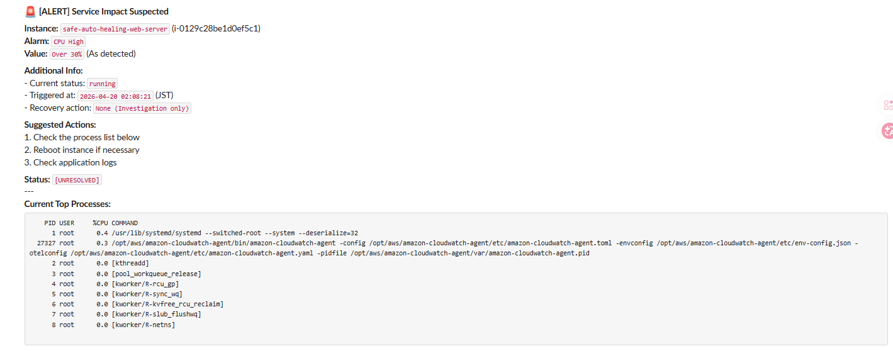

# Safe Auto-Healing System（安全志向のインシデント対応自動化）

AWS上で構築したインシデント対応自動化システムです。
アラート検知後の対応プロセスを最適化し、MTTR（平均復旧時間）の短縮を目的としています。

完全自動化ではなく、安全性と人間の判断を重視した設計を採用しています。

---

## ■ 概要

本システムは、CloudWatchアラームをトリガーとして、

* 自動復旧（Auto-Healing）
* 人間による判断支援（Human-in-the-loop）

を使い分けることで、
**安全かつ迅速なインシデント対応**を実現します。

---

## ■ Slack通知（実行結果の可視化）

### ● L1：Auto-Healing（自動復旧）

安全な範囲の障害は自動復旧し、結果を即時通知します。

---

### ● L2：Human-in-the-loop（判断支援）

判断が必要な障害は自動実行せず、
コンテキストと推奨アクションを提示して人間の意思決定を支援します。

---

## ■ 解決した課題

実運用においてよくある問題：

* アラートの見逃し（メール依存）
* 状況把握に時間がかかる
* 対応の属人化
* 復旧時間のばらつき

本システムではこれらに対し、
**「速く直す」ための仕組みを設計**しています。

---

## ■ コンセプト

* 障害はなくならない（前提）
* MTTRを短くすることに集中する
* 安全な操作のみ自動化する
* 判断が必要なものは人に任せる

---

## ■ アーキテクチャ

EC2
↓
CloudWatch（監視・検知）
↓
Lambda（判定・制御）
↓
SSM（コマンド実行）
↓
Slack（通知）

---

## ■ フロー

CloudWatch Alarm
↓
Lambda（Python）
↓
アクション or 判断支援
↓
Slack通知

---

## ■ シナリオ1：自動復旧（L1）

### ● 概要

軽微かつ再現性の高い障害を自動復旧します。

---

### ● フロー

* 異常検知（CPU / HTTP）
* Lambda起動
* SSM経由でNginx再起動
* ヘルスチェック
* Slack通知

---

### ● 特徴

* タグベース制御（auto-healing=true）
* SSM実行状態の確認
* リトライ機構（最大5回）
* 成否をSlack通知

---

👉 **安全に限定した自動化**

---

## ■ シナリオ2：人間判断支援（L2）

### ● 概要

自動化できない障害に対して、
判断材料を提供し人間の意思決定を支援します。

---

### ● フロー

* 異常検知（CPUなど）
* Lambda起動
* SSMで情報収集（topなど）
* Slackに構造化通知
* 人間が対応

---

### ● 特徴

* 自動復旧しない設計
* コンテキスト付き通知
* プロセス情報取得
* 推奨アクション提示

---

👉 **「速く判断できる」ことを重視**

---

## ■ 設計思想

### ● すべてを自動化しない

誤った自動化はリスクを増やすため、
安全な範囲のみ自動化する。

---

### ● 障害は前提

ゼロにはできないため、
復旧速度（MTTR）を最適化する。

---

### ● 自動化と人間判断の分離

* L1：自動復旧
* L2：人間判断

---

### ● 安全性優先

* 影響が大きい操作は自動化しない
* コンテキスト提供を優先

---

## ■ 技術スタック

* Python
* AWS Lambda
* Amazon CloudWatch
* AWS Systems Manager（SSM）
* Terraform
* Ansible
* Slack Webhook

---

## ■ 今後の拡張

* L3（完全手動対応）
* クールダウン機構
* インシデント履歴管理
* 自動エスカレーション

---

## ■ 著者

Akira Takahashi

---

## ■ まとめ

本システムは以下を実現します：

* MTTRの短縮
* 安全な自動化
* 人間とシステムの協調

---

**「すべてを自動化するのではなく、
何を自動化すべきかを設計する」**

という思想に基づいています。
