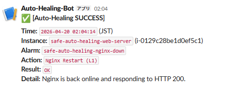
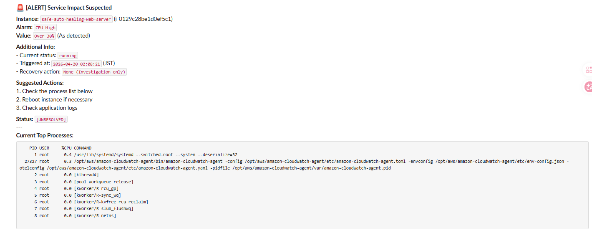
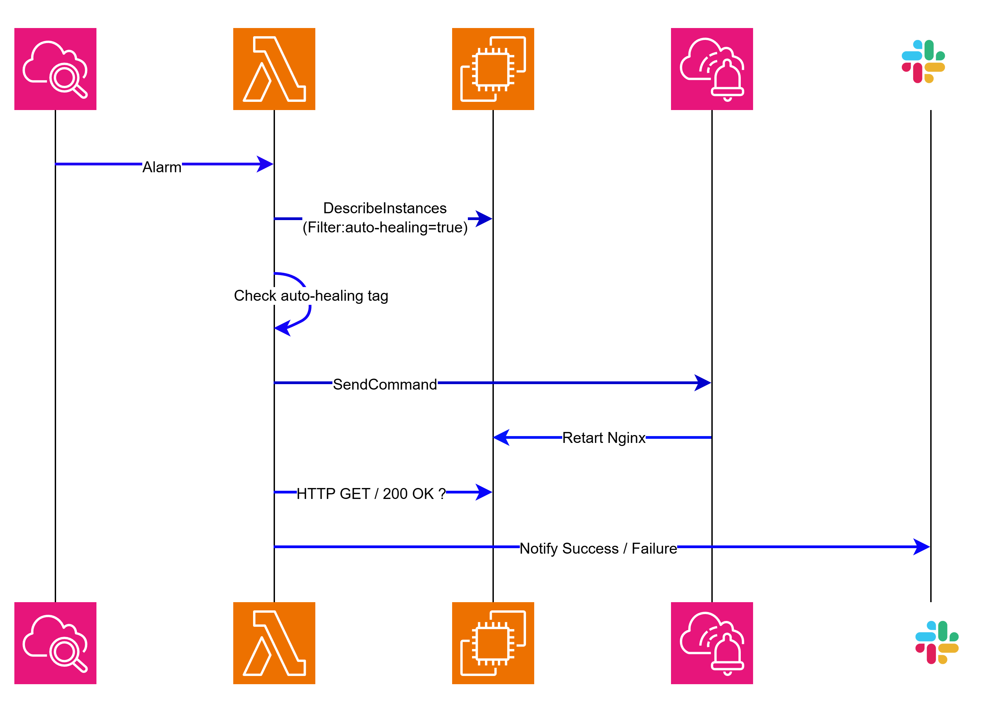
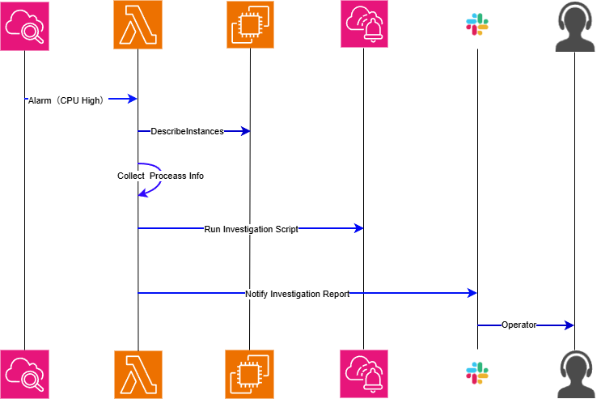

# Safe Auto-Healing System（安全なインシデント対応自動化ツール）

本仕組みは、AWS環境で発生したシステムトラブルの検知から復旧までの時間を縮め、システム停止によるビジネス損失を最小限に抑えるための「運用復旧支援ツール」です。  
すべてをシステム任せにせず、**「自動で直せる軽微なトラブル」と「人間の判断が必要な複雑なトラブル」を明確に切り分ける安全設計**を形にしています。

---

## ■ 想定読者

* **クラウド運用担当者・インフラエンジニア**
* **システムの復旧時間（ダウンタイム）を短縮したいチーム**
* **安全な自動運用フローを設計・導入したいマネージャー**

---

## ■ 概要

本ツールは、システム異常（アラーム）を検知した際、トラブルの度合いに応じて以下の2つのアプローチを自動で使い分けます。

* **L1：自動復旧（Auto-Healing）**
  原因が明確な軽いトラブルは、プログラムが自動で安全に復旧させます。
* **L2：人間による判断支援**
  判断が必要な複雑なトラブルは、勝手に動かさず、トラブルの状況と推奨される対応手順を人間に通知して判断を仰ぎます。

安全な範囲のみを自動化し、重要な判断は人間に任せることで、迅速かつリスクのないインシデント対応フローを実現します。

---

## ■ 解決できる現場の課題

運用作業では、次のようなヒューマンエラーが事故につながる可能性があります。

* **メール通知の埋もれによる、トラブルの検知遅れ**
* **サーバー状況の調査（ログ確認やコマンド実行）にかかるタイムロス**
* **対応手順が属人化しており、担当者によって復旧時間にばらつきが出る**

本ツールは、「手順を効率化する」のではなく、**「復旧までの時間を縮め、現場の対応コストを下げること」**を目的として設計しています。

---

## ■ 2つの対応フロー（実行結果の可視化）

### ● L1：自動復旧（Auto-Healing）

あらかじめ決めておいた安全な範囲のトラブル（例：Webサーバーのプロセス停止など）はシステムが自動復旧し、その成否をチャット（Slack）へ即時通知します。

---

### ● L2：人間による判断支援

調査が必要なトラブルの場合、システムは勝手な復旧操作を行いません。  
代わりに、現在のサーバー負荷（topコマンドの結果など）を自動で即座に収集・整理し、推奨アクション（対応手順の候補）と一緒にチャットへ通知して人間の意思決定をサポートします。

---

## ■ 全体の連携図（アーキテクチャ）

1. **検知（CloudWatch）:** サーバーの異常を検知します。
2. **判定・制御（Lambda）:** トラブルの度合い（L1かL2か）を自動判定します。
3. **実行・調査（Systems Manager）:** 復旧コマンドの実行、または状況調査のための情報収集を行います。
4. **通知（Slack）:** 結果や調査データを、人間が見やすい形に構造化してチャットへ通知します。

---

## ■ シナリオ1：自動復旧フロー（L1）

### ● システムシーケンス（L1）
インシデント検知から自動復旧、そしてSlack通知にいたる詳細なシーケンス図です。

### ● 詳細手順

* 異常検知（CPU負荷やWebアクセスエラーなど）
* 判定プログラムの起動
* 対象サーバーの特定と、自動復旧コマンドの実行
* 復旧後の正常性確認（ヘルスチェック）
* チャットへの結果通知

### ● 安全設計の特徴

* **タグベース制御:** 誤動作を防ぐため、事前に「自動復旧を許可（auto-healing=true）」と設定されたサーバーのみを対象にします。
* **リトライ機構:** 一時的なエラーを考慮し、最大5回までの安全な再試行を行います。

---

## ■ シナリオ2：人間判断支援フロー（L2）

### ● システムシーケンス（L2）
インシデント検知後、システムが自律的に調査スクリプトを走らせ、人間にコンテキストを届けるまでのイベントフローです。

### ● 詳細手順

* 異常検知
* 判定プログラムの起動
* 原因特定に必要な情報（プロセス状況など）の自動収集
* チャットへの構造化通知（状況データ ＋ 推奨対応手順）
* 通知をもとに人間が迅速に判断・対応

### ● 安全設計の特徴

* **自律的な不具合調査:** 人間がサーバーにログインして調査する手間と時間を無くすため、システムが必要なデータを先回りして集めます。
* **勝手に動かさない安全性:** 影響範囲が不明なトラブルに対しては、自動復旧の手を止めて通知に徹します。

---

## ■ システム復旧に対する設計思想

本ツールは単なる自動化スクリプトではなく、実務における以下の思想をベースに設計・実装しています。

### ● 「すべてを自動化」しない
誤った自動化は二次災害を招くリスクがあります。影響が大きい操作や判断が必要なものはあえて人に任せることで、運用の安全性を担保します。

### ● 障害の発生を前提とする
トラブルをゼロにすることは難しいため、**「起きてしまった後に、いかに早く、迷わずに復旧できるか（復旧時間の最短化）」**に焦点を当てています。

### ● 理想よりも「現場での判断スピード」を最優先
トラブル発生時にオペレーターが最も時間を取られるのは「状況の把握」と「対応の迷い」です。必要なデータをシステムが先回りして届けることで、現場のストレスと対応時間を削減します。

---

## ■ クラウドサービスに依存しない汎用的なアプローチ

この「システムによる自動一次対応・情報収集」と「人間による最終判断」を組み合わせるアプローチは、今回のAWS環境に限らず、あらゆるインフラ運用に共通する課題への解決策です。  
特定のテクノロジーの組み合わせに留まらず、汎用的な運用モデルとして本ツールを構築しています。

---

## ■ 技術スタック

* **AWS Lambda**（判定・制御）
* **Amazon CloudWatch**（異常検知）
* **AWS Systems Manager (SSM)**（復旧・調査）
* **Terraform**（IaCによるインフラ構築）
* **Ansible**（構成管理）
* **Python**（ロジック実装）
* **Slack Webhook**（構造化通知）

---

## ■ 今後の拡張

* 手動対応用コマンドの追加（L3対応）
* 短時間に同じアラートが連続した際の抑止機能（クールダウン機構）
* インシデントの履歴管理と自動エスカレーション

---

## ■ 本ツールを通じてお伝えしたいこと（インシデント対応へのアプローチ）

本ツールは、AWS上でAuto-Healingを実現することだけが目的ではありません。  
実運用を想定した際に、

* **インシデント対応フローの設計**
* **復旧時間（MTTR）の短縮**
* **人間とシステムの役割分担**
* **安全な自動復旧**

をどのように現場へ組み込み、運用として成立させるかを示したサンプルです。  
単に障害を自動復旧するコードを書くのではなく、**障害発生後の対応を分析し、安全かつ迅速に復旧できる仕組みとして設計・実装すること**を目的としています。  
なお、本ツールは、人の判断を尊重しながら自動化を進める **Human-in-the-loop** の考え方をベースにしています。

---

## ■ 著者

Akira Takahashi